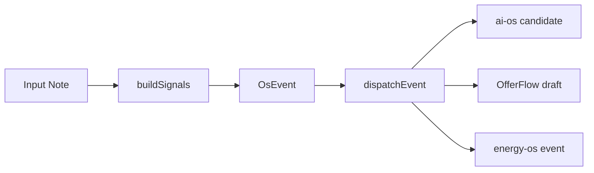

# Personal OS Event Flow Demo

## Demo 目标

这个 demo 用合成样例说明 `personal-os` 如何把散落输入转成事件，并分发到 ai-os、OfferFlow 或 energy-os。

本文件不使用真实日记、真实 events、真实 job-intake、真实 inbox 或真实 review-queue 内容。

## 合成输入

```txt
今天看到一个 AI 前端岗位，JD 提到 Prompt、Workflow 和内部提效，我想判断是否值得沟通。
```

## 处理流程

1. 用户输入 diary 或 JD note。
2. `os-daemon` 或脚本监听输入。
3. `buildSignals` 根据文本生成 `careerRelated`、`promptCandidate`、`workflowCandidate`、`methodCandidate` 等信号。
4. `emit-event` 生成 `OsEvent`。
5. `dispatch-event` 根据 `signals` 选择 consumer。
6. consumer 写入下游草稿、候选或事件。

## 合成信号示例

```json
{
  "careerRelated": true,
  "promptCandidate": true,
  "workflowCandidate": true,
  "methodCandidate": true,
  "energyImpact": 0,
  "reviewNeeded": true
}
```

这只是合成信号示例，实际字段以 `scripts/emit-event.ts` 中的 `EventSignals` 为准。

## 下游结果

- ai-os：生成 method candidate、workflow candidate 或 prompt candidate，后续人工 review 后才可能沉淀为 Skill、Playbook 或 Workflow。
- OfferFlow：通过 JD import bridge 生成 JD draft / opportunity draft，后续由 OfferFlow 处理 parser、pending review 和业务流转。
- energy-os：仅当事件包含情绪或能量信号时生成 energy event。

## 流程图



## ASCII 流程

```txt
Input Note
  -> buildSignals
  -> OsEvent
  -> dispatchEvent
  -> ai-os / OfferFlow / energy-os
```

## Demo 边界

- 这不是自动 AI 分析。
- 这不是自动投递。
- 这不是自动打招呼。
- 这不是 OfferFlow 决策。
- 这不是 energy-os 分析。
- 这只是事件分发 demo。
